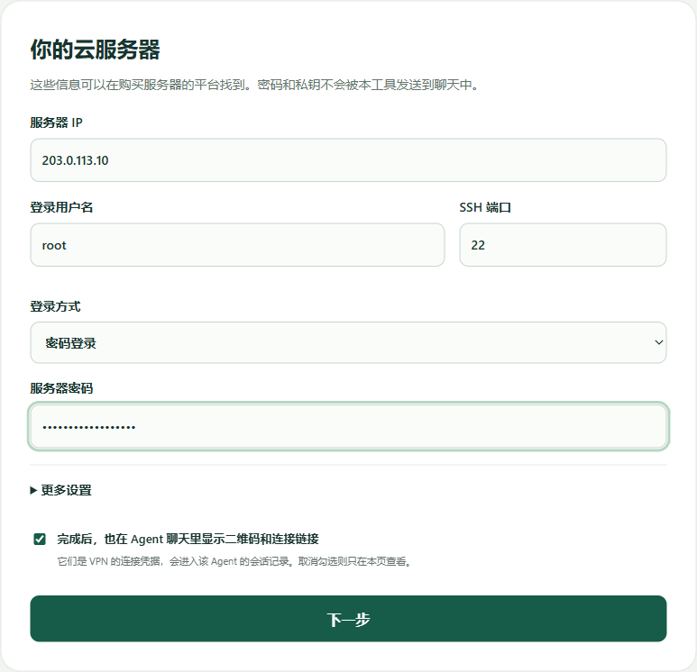
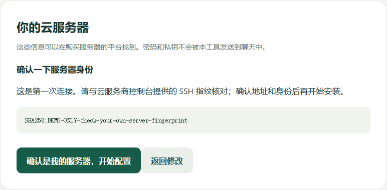
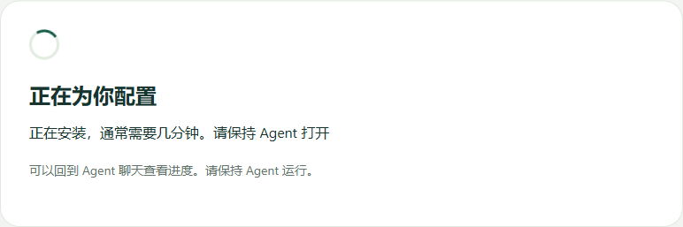
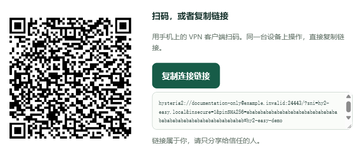

<p align="center"></p>

<p align="center"><strong>让 Agent 帮你配好，扫码或复制就能连接。</strong></p>

<p align="center">
  <a href="#开始使用">开始使用</a> ·
  <a href="https://github.com/UncleK/hy2-easy/releases">下载</a> ·
  <a href="docs/manual-setup.md#连不上怎么办">遇到问题</a>
</p>

## 开始使用

准备好**一台自己的云服务器**和**能执行本地工具的 Agent**，例如 DSH、WorkBuddy。

**已经有连接链接或二维码？** 直接跳到[最后一步](#5-扫码或粘贴开始连接)。

### 1. 复制这段话，发给 Agent

点击代码块右上角的复制按钮，粘贴到 Agent 的聊天窗口。

```text
帮我用 hy2-easy 配置自己的 VPN，请先阅读：
https://github.com/UncleK/hy2-easy/blob/main/docs/agent.md

打开本机页面，让我填写服务器登录信息，不要在聊天里索取密码或私钥。
配置完成后，给我二维码、连接链接和客户端下载链接。
```

### 2. 打开页面，填写信息

打开 Agent 给出的链接，把云服务商提供的登录信息填进去，然后点 **「下一步」**。

<sub>以下为真实界面的演示截图。请填自己的信息，不要照抄图中的地址或扫描示例二维码。</sub>



### 3. 确认是自己的服务器

按页面提示核对身份，确认无误后，点 **「确认是我的服务器，开始配置」**。



### 4. 等待配置完成

看到这个页面就等一会儿，**保持 Agent 打开**，不用重复点击或重新安装。



### 5. 扫码或粘贴，开始连接

先安装客户端，再添加刚刚生成的连接。

| 你的设备 | 下载客户端 | 怎么添加连接 |
| --- | --- | --- |
| Windows 电脑 | [下载 v2rayN](https://github.com/2dust/v2rayN/releases/download/7.24.9/v2rayN-windows-64.zip) | 解压打开 → 复制链接 → 按 **Ctrl + V** 导入 → 选中线路并开启系统代理 |
| 安卓手机 | [下载 v2rayNG](https://github.com/2dust/v2rayNG/releases/download/2.2.6/v2rayNG_2.2.6_arm64-v8a.apk) | 安装打开 → 点 **+** → 扫码或从剪贴板导入 → 点连接按钮 |

**手机扫二维码，同一台设备就点「复制连接链接」。** 使用你自己配置页面里的连接信息。



---

<details>
<summary>还没准备服务器？</summary>

本项目不提供免费线路，需要一台你自己的云服务器。新建时建议选 Ubuntu 24.04，并在云服务商的防火墙 / 安全组中放行 UDP 24443。

不知道在哪里操作，可以把云服务商名称告诉 Agent，让它指引你；也可以查看[服务器准备说明](docs/manual-setup.md#1-准备一台云服务器)。

</details>

<details>
<summary>苹果、Clash 或其他 Agent 能用吗？</summary>

配置页面的「其他客户端」中有更多选择。Mihomo（Clash.Meta）可以下载配置文件导入；苹果端尚未真机验证，请参考[兼容客户端列表](https://v2.hysteria.network/docs/getting-started/3rd-party-apps/)。

Agent 需要能运行本地工具。DSH、WorkBuddy 已提供接入配置，但各自聊天界面尚未完成实测。聊天中显示不了二维码时，回到本机页面即可。[查看接入说明](docs/agent.md)

</details>

<details>
<summary>下载失败或连接不上？</summary>

优先使用 GitHub 官方下载，打不开时查看[服务器备份站](https://agentschat.app/hy2-easy-downloads/)。当前备份提供本项目工具和检测组件，第三方客户端整包尚未镜像；海外备份也不保证所有网络都能直连。

连接问题请按[排查步骤](docs/manual-setup.md#连不上怎么办)检查，或将错误文字发给 Agent。不要公开自己的密码、二维码或完整连接链接。

</details>

<details>
<summary>想自己动手？展开手动安装</summary>

在自己的 Linux 云服务器终端运行：

```bash
curl -fsSLo hy2-easy-install.sh https://github.com/UncleK/hy2-easy/releases/download/v0.2.0/install.sh && sudo bash hy2-easy-install.sh
```

支持 Debian 12/13、Ubuntu 22.04/24.04。安装前放行 UDP 24443，按提示填写公网 IP，完成后扫码或复制链接导入。

[完整手动教程](docs/manual-setup.md) · [管理、备份与卸载](docs/operations.md)

</details>

<details>
<summary>项目与开发资料</summary>

hy2-easy 基于 Hysteria 2，简化的是安装和配置。没有管理面板、账户后台、广告或本项目的使用统计；不承诺匿名性或所有网络都能连接。

[MIT 开源](LICENSE) · [数据与证书](docs/security.md) · [验证范围](docs/verification.md) · [参与开发](CONTRIBUTING.md)

hy2-easy 0.2.0 使用 Hysteria 2.12.2。原名 `xray-personal-gateway`，旧实现保留在 Git 历史中。

</details>
