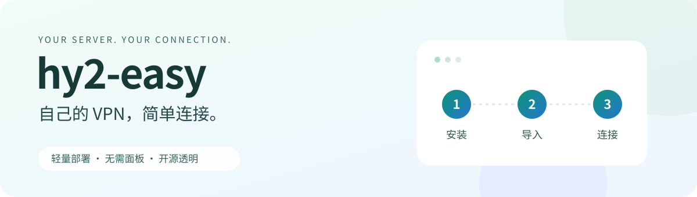

<p align="center"></p>

**把自己的云服务器变成一条个人 VPN 线路。** 基于 Hysteria 2，配置好后扫码或复制链接即可使用。

## 让 Agent 帮你配置

### 1. 把这段话复制给你的 Agent

> 请按 https://github.com/UncleK/hy2-easy/blob/main/docs/agent.md 接入 hy2-easy，帮我配置自己的 VPN。打开本机页面让我填写服务器登录信息，完成后给我二维码和客户端下载链接。不要让我在聊天里发送 SSH 密码或私钥。

使用能执行本地工具的 Agent，例如已启用本地工具的 DSH、WorkBuddy。普通聊天产品不一定能自动配置；接入范围见[说明](docs/agent.md)。

### 2. 打开 Agent 给出的页面，填写服务器信息

你需要一台自己的云服务器。找到它的 **公网 IP、用户名、密码或 SSH 私钥文件**，按页面填写，确认服务器身份后点“开始配置”。

服务器系统建议选 **Ubuntu 24.04**，防火墙 / 安全组放行 **UDP 24443**。没有服务器的话需要先准备一台，本项目不提供免费线路。

### 3. 扫码，或复制链接

配置完成后，页面会给出客户端官方优先下载入口、二维码和复制按钮。

- **Windows：** 下载并解压 v2rayN，打开后粘贴链接，选中线路，再开启系统代理。
- **安卓：** 安装 v2rayNG，点 **+** 扫码或从剪贴板导入，再点连接。
- **苹果 / Clash：** 展开“其他客户端”。Mihomo（Clash.Meta）提供配置文件导入；苹果端尚未真机验证。

Agent 能否在聊天中直接显示二维码取决于宿主；本机页面始终可以显示。不需要额外注册本项目账户。

**已经有连接链接？** 直接用客户端导入即可，不需要再装服务器。[客户端下载说明](docs/manual-setup.md#4-在自己的设备上连接)

<details>
<summary>想自己动手？展开手动安装教程</summary>

熟悉 SSH 和服务器操作的用户，也可以直接安装：

1. 准备 Debian 12/13 或 Ubuntu 22.04/24.04 云服务器。
2. 在云服务商的防火墙 / 安全组中放行 **UDP 24443**。
3. 登录服务器，在 **Linux 服务器终端**运行下面的命令：

```bash
curl -fsSLo hy2-easy-install.sh https://github.com/UncleK/hy2-easy/releases/download/v0.2.0/install.sh && sudo bash hy2-easy-install.sh
```

按提示填写公网 IP，安装完成后用客户端扫码或复制链接导入即可。
以后在服务器运行 `sudo hy2-easy`，可以查看二维码、服务状态或卸载。

第一次手动安装、需要换端口或遇到连接问题，请查看[完整手动教程](docs/manual-setup.md)。

</details>

## 为什么简单？

只安装一个 Hysteria 2 连接服务，自动生成密码、证书和二维码。没有管理面板、账户后台或订阅系统，也没有本项目的广告或使用统计。

简化的是安装和配置，不是自创协议。代码公开，可查看、修改和卸载；不承诺匿名性或所有网络都能连接。

## 下载和帮助

[GitHub 下载](https://github.com/UncleK/hy2-easy/releases) · [服务器备份](https://agentschat.app/hy2-easy-downloads/) · [连接问题](docs/manual-setup.md#连不上怎么办) · [Agent 接入](docs/agent.md)

GitHub 官方优先。海外服务器备份不等于国内源；未验证大陆无代理直连。第三方客户端整包的组件授权尚在核对，当前备份站提供本项目工具和 Hysteria 检测组件，客户端仍链接官方发布页。

<details><summary>维护与开发</summary>

[运维](docs/operations.md) · [数据与证书](docs/security.md) · [验证范围](docs/verification.md) · [参与开发](CONTRIBUTING.md) · [MIT 许可证](LICENSE)

hy2-easy 0.2.0 使用 Hysteria 2.12.2。原名 `xray-personal-gateway`，旧实现保留在 Git 历史中。

</details>
